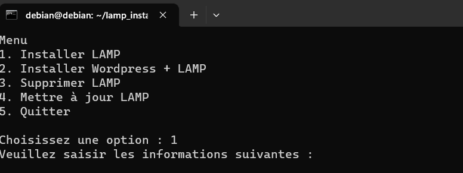
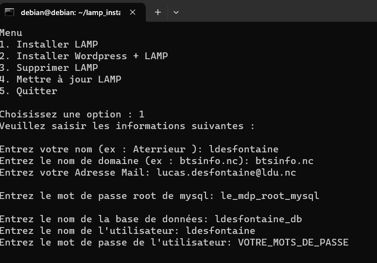
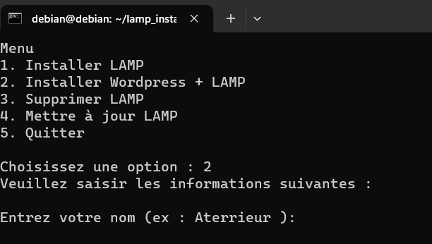

# Guide d'utilisation de l'installation de lamp & wordpress

## Prérequis

- Avoir une machine debian
- Télécharger le script d'installation de lamp & wordpress

```
git clone https://github.com/ldesfontaine/lamp_installer_wp.git
```
<hr>

## Utilisation

- Se rendre dans le dossier du script

```
cd lamp_installer_wp
```


- Lancer le script


```
sudo bash setup_lamp_wp.sh
```


### Menu du script


## Options 1 : Installation de lamp


### Vous allez devoir saisir certaines informations permettant la configuration de votre fichier Apache et de Mysql:


### Une fois toutes les informations saisies, l'installation va commencer

### ATTENTION, pendant l'installation le script vous demandera de saisir 3 fois le mot de passe de votre vps
#### Il s'agit du mot de passe de votre utilisateur root ou debian.

#### `Le mot de passe ne s'affiche pas lors da la saisie attentions` 


### Une fois toutes ces étapes effectuées, votre installation de lamp sera terminée !
#### Il vous suffira de redémarrer votre service apache, pour cela, vous pouvez utiliser la commande suivante:
```
sudo service apache2 restart
```


<hr>


## Options 2 : Installation de wordpress


### Vous allez devoir saisir certaines informations permettant la configuration de votre fichier Apache et de Mysql:

### `Retenez bien ces informations, elles vous seront demandées lors de la configuration de wordpress`

### ATTENTION, pendant l'installation le script vous demandera de saisir 3 fois le mot de passe de votre vps
#### Il s'agit du mot de passe de votre utilisateur root ou debian.

#### `Le mot de passe ne s'affiche pas lors da la saisie attentions`


### Une fois toutes ces étapes effectuées, le script téléchargera Wordpress et le décompressera dans le dossier /var/www/Votre_Nom


### Une fois l'installation terminée, vous devrez configurer wordpress
#### Pour cela, rendez-vous sur votre navigateur et saisissez l'adresse suivante:
```
http://virtual_host.nom_de_domaine/
```
#### Vous devriez voir la page d'accueil de wordpress
#### Poursuivez l'installation et assurez-vous de bien renseigner les informations suivantes:

#### Il s'agit des informations que vous avez saisies lors de l'installation de wordpress


<hr>

## Options 3 : Suppression de lamp
### ATTENTION, cette option supprimera tous les fichiers de lamp
#### Si vous souhaitez supprimer uniquement wordpress, vous pouvez utiliser la commande suivante:
```
sudo rm -r /var/www/Votre_Nom
```

<hr>

## Options 4 : Mise à jour de lamp
#### ATTENTION, cette option peut prendre du temps, soyez patient
### Cette option permet de mettre à jour linux, apache, mysql et php
