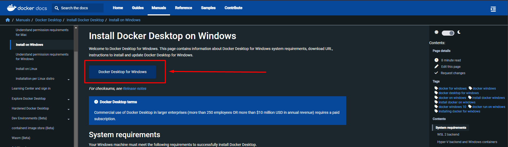

# Docker 

 ## Installer docker sur une machine Windows

### Prérequis

- Windows 10 ou 11
- Hyper-V activé
- 4 Go de RAM
- Virtualisation activée dans le BIOS
- Docker Desktop ne fonctionne pas sur les systèmes FAT32 ou exFAT.

### Installation

1. Télécharger Docker Desktop pour Windows
    - [Docker Desktop pour Windows](https://hub.docker.com/editions/community/docker-ce-desktop-windows)
    - 

2. Double-cliquer sur Docker Desktop Installer.exe pour lancer l'installateur.
    - Si vous n'avez pas Hyper-V d'activé, l'installateur vous proposera de l'activer.

3. Suivre les instructions de l'installateur.

4. Redémarrer votre machine.

 Sous windows Docker fonctionne soit avec WSL (Windows Subsystem for Linux) ou avec Hyper-V.
 Il est possible de changer de mode en allant dans les paramètres de Docker Desktop.
 ### Je vous conseille d'utilise Hyper-V car il est plus performant.